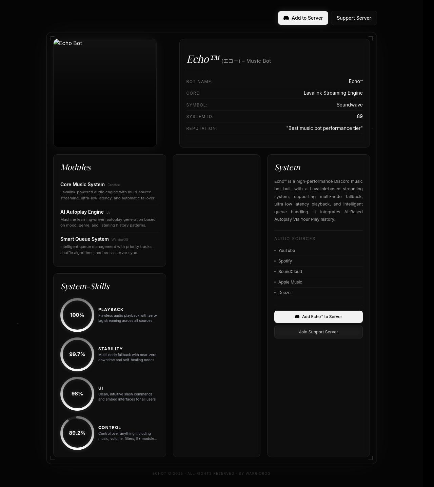
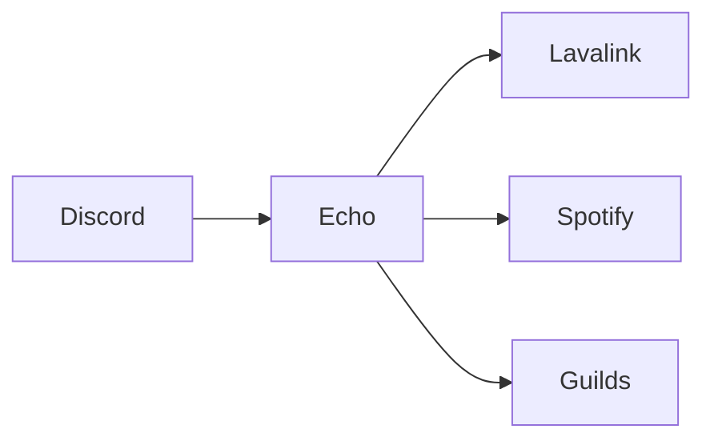

# Echo™ Music

> Premium Discord Music Experience

<p align="center">
  
</p>

<p align="center">

</p>

<p align="center">


</p>

---

# ✨ Experience Music, Reimagined

Echo™ Music is a modern Discord music bot focused on premium design, blazing performance, Spotify integration, rich controls, and an exceptional user experience.

## 🚀 Features

- Spotify Support
- Queue System
- Lyrics
- Autoplay
- Shuffle
- Loop
- Filters
- Volume Control
- Slash Commands
- Beautiful UI
- Optimized Performance

---

## 📸 Preview


---

## 🏗️ Architecture



---

## 📦 Installation

```bash
git clone https://github.com/USERNAME/Echo-Music.git
cd Echo-Music
npm install
npm run dev
```

---

## 📂 Structure

```text
assets/
src/
commands/
events/
README.md
package.json
```

---

## 🗺️ Roadmap

- [x] Music Playback
- [x] Spotify
- [x] Queue
- [ ] Dashboard
- [ ] AI Recommendations
- [ ] Web Player

---

Made with ❤️ by WarriorOG
